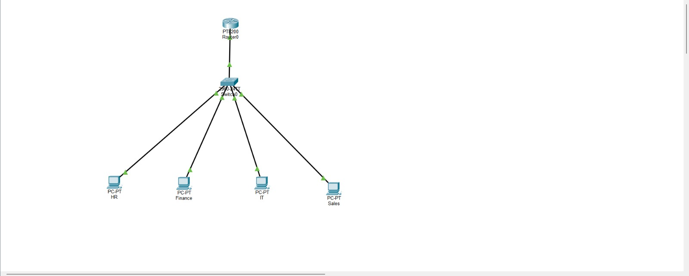
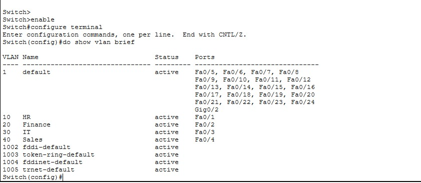
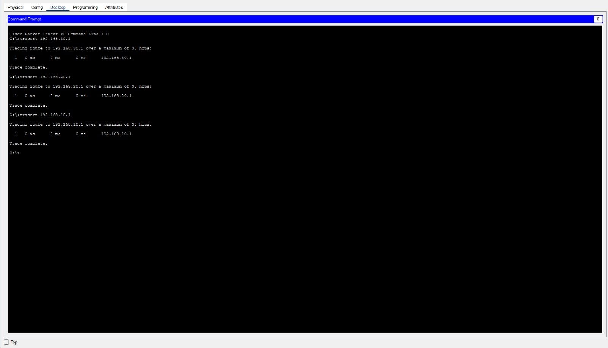

# Campus LAN Infrastructure Deployment

## Purpose

Design and implement a secure and scalable enterprise Local Area Network (LAN) for multiple departments with proper network segmentation and Inter-VLAN communication.

---

## Project Description

Designed and implemented an enterprise campus network consisting of **HR**, **Finance**, **IT**, and **Sales** departments using **Cisco Packet Tracer**. Configured **VLANs**, **802.1Q trunk links**, **Router-on-a-Stick**, **Spanning Tree Protocol (STP)**, and **IPv4 subnetting** to provide efficient traffic management, network segmentation, and reliable communication between departments. Connectivity was verified using **Ping** and **Traceroute**.

---

## Technologies Used

- Cisco Packet Tracer
- TCP/IP
- IPv4
- VLAN
- 802.1Q Trunking
- Spanning Tree Protocol (STP)
- Router-on-a-Stick

---

## Requirements

- Cisco Packet Tracer 8.x or later

> **Note:** This project was designed and tested only in Cisco Packet Tracer.

---

## Skills Covered

- TCP/IP
- OSI Model
- IPv4 Addressing
- Basic Subnetting
- Routing & Switching
- VLAN Configuration
- Trunk Configuration
- Spanning Tree Protocol (STP)
- Router-on-a-Stick
- Port Configuration
- Enterprise LAN Design
- Network Verification
- Ping
- Traceroute

---

## Project Structure

```text
Campus-LAN-Infrastructure-Deployment/
├── README.md
├── Campus-LAN-Infrastructure-Deployment.pkt
└── screenshots/
    ├── Topology.jpeg
    ├── VLAN.jpeg
    ├── Ping.jpeg
    └── Tracert.jpeg
```

---

## Screenshots

### Network Topology



---

### VLAN Configuration



---

### Ping Test


---

### Traceroute Test



---

## Network Features

- Multi-department enterprise LAN
- VLAN segmentation
- Inter-VLAN Routing
- Router-on-a-Stick
- IEEE 802.1Q Trunking
- Spanning Tree Protocol (STP)
- IPv4 Addressing
- Subnetting
- End-to-End Connectivity Testing

---

## Verification

The following tests were performed successfully:

- VLAN communication
- Inter-VLAN Routing
- End-to-End Ping
- Traceroute Verification
- Network Connectivity Testing

---

## Result

Successfully designed and deployed a secure, scalable enterprise campus LAN with multiple VLANs and Inter-VLAN Routing. Network communication between all departments was verified using Ping and Traceroute, demonstrating proper routing, switching, and traffic segmentation.

---

## Software

- Cisco Packet Tracer 8.x or later

---

## Author

**Rajkumar S**


Interested in:
- Enterprise Networking
- Routing & Switching
- Network Security
- Linux Administration
- Network Automation
