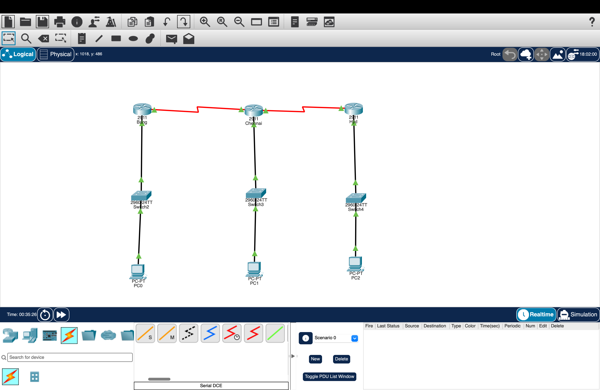
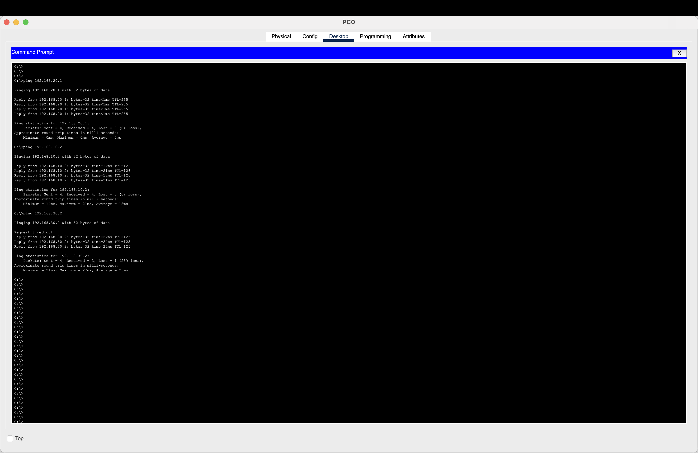
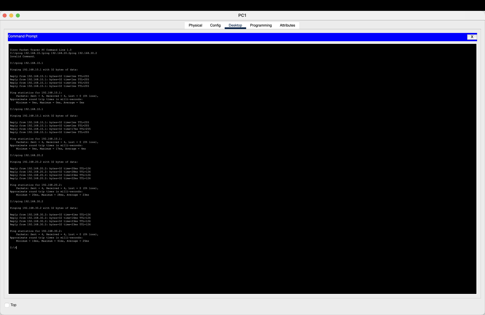
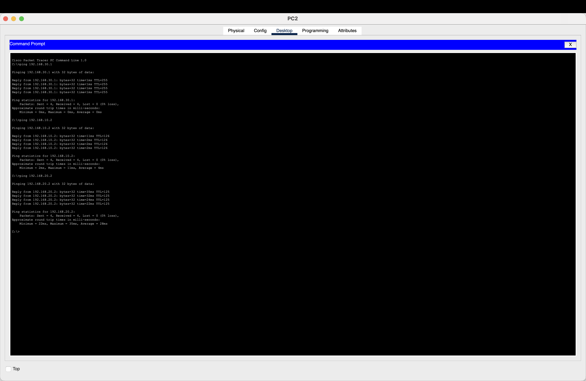

# Multi-Branch WAN Connectivity Using OSPF

## Purpose

Design and implement a multi-branch Wide Area Network (WAN) using dynamic routing to provide reliable communication between geographically separated branch offices.

---

## Project Description

Designed and implemented a multi-branch enterprise WAN using **Cisco Packet Tracer**, connecting **Bangalore**, **Chennai**, and **Hyderabad** branch offices. Configured **OSPF (Open Shortest Path First)** for dynamic routing over serial WAN links, assigned IPv4 addressing for LAN and WAN networks, and established end-to-end connectivity between all branches. Network functionality was verified using **Ping**, **OSPF neighbor verification**, and routing table inspection.

---

## Technologies Used

- Cisco Packet Tracer
- TCP/IP
- IPv4
- OSPF
- Serial WAN Links
- Routing & Switching

---

## Requirements

- Cisco Packet Tracer 8.x or later

> **Note:** This project was designed and tested only in Cisco Packet Tracer.

---

## Skills Covered

- TCP/IP
- OSI Model
- IPv4 Addressing
- Basic Subnetting
- OSPF Configuration
- Dynamic Routing
- WAN Configuration
- Serial Interface Configuration
- Router Configuration
- Switch Configuration
- Routing Verification
- Ping
- OSPF Neighbor Verification

---

## Project Structure

```text
Multi-Branch-WAN-Connectivity-Using-OSPF/
├── README.md
├── Multi-Branch-WAN-Connectivity-Using-OSPF.pkt
└── screenshots/
    ├── Network-Topology.png
    ├── Router-Verification.png
    ├── Ping-Bangalore.png
    ├── Ping-Chennai.png
    └── Ping-Hyd.png
```

---

## Screenshots

### Network Topology



---

### Router Verification


---

### Ping Test – Bangalore



---

### Ping Test – Chennai



---

### Ping Test – Hyderabad



---

## Network Features

- Multi-Branch WAN Topology
- OSPF Dynamic Routing
- Serial WAN Connectivity
- IPv4 Addressing
- Router-to-Router Communication
- LAN-to-LAN Connectivity
- End-to-End Network Communication
- Dynamic Route Learning
- Network Verification

---

## Verification

The following tests were performed successfully:

- OSPF Neighbor Adjacency Verification
- Routing Table Verification
- Interface Status Verification
- End-to-End Ping
- Inter-Branch Connectivity Testing

---

## Result

Successfully designed and deployed a multi-branch WAN connecting Bangalore, Chennai, and Hyderabad using OSPF dynamic routing. End-to-end communication between all branch LANs was successfully verified through Ping, routing table inspection, and OSPF neighbor verification, demonstrating reliable WAN connectivity and dynamic route exchange.

---

## Software

- Cisco Packet Tracer 8.x or later

---

## Author

**Rajkumar S**

Interested in:
- Enterprise Networking
- Routing & Switching
- Network Security
- Linux Administration
- Network Automation
